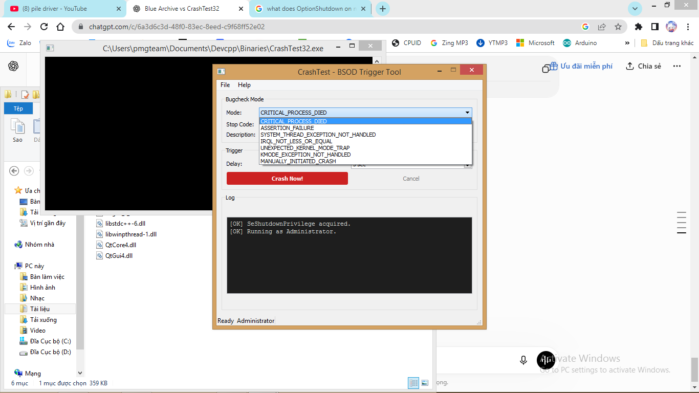

# CrashTest32

CrashTest32 is an open-source Windows BSOD testing utility.

# ScreenShot:

## What does it do?

CrashTest32 intentionally triggers a Windows bugcheck (Blue Screen of Death) for:

- Crash dump generation
- WinDbg debugging practice
- BSOD testing
- Educational research

## Warning

This software intentionally crashes Windows.

Save all work before using it.

Administrator privileges are required.
